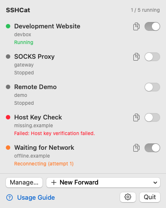
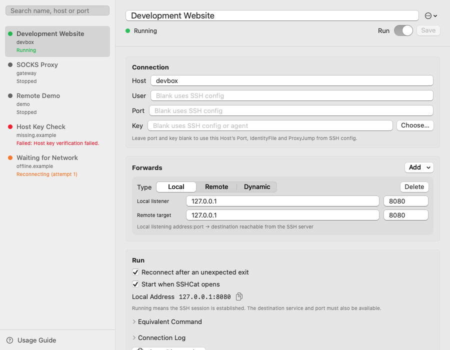

# SSHCat

[简体中文](README.md) · **English**

A macOS menu bar app for long-running SSH port forwarding. SSHCat runs the system `ssh -N` as a child process and supervises it, reconnecting with backoff after an unexpected exit, wake from sleep, or a network change. It does not implement the SSH protocol.

Each rule runs one SSH connection and can combine local (`-L`), remote (`-R`), and dynamic (`-D`) forwards to the same host.

<p>
  
  
</p>

Screenshots use temporary sample data and a fake SSH process. They contain no real configuration or connections.

## Requirements

- macOS 13 or later, on Apple silicon or Intel.
- The system `/usr/bin/ssh`, or another executable selected in Settings.
- Key-based or ssh-agent authentication already working for the destination. SSHCat uses `BatchMode=yes` and does not show password prompts.
- Connect to a new host once in Terminal and verify its host key before using it in SSHCat. With `BatchMode=yes`, an unknown host key causes the connection to fail instead of asking for confirmation.

## Installation

1. Download `SSHCat-<version>.dmg` from [Releases](https://github.com/zhdsmy/SSHCat/releases), open it, and drag SSHCat into Applications.
2. The app is ad-hoc signed and has not been notarized by Apple. If macOS blocks the first launch, use **System Settings → Privacy & Security → Open Anyway**, or run `xattr -dr com.apple.quarantine /Applications/SSHCat.app`.
3. Optionally download the matching `.sha256` file and verify the DMG with `shasum -a 256 -c SSHCat-<version>.dmg.sha256` from the download directory.

**Check for Updates** in Settings contacts GitHub only when clicked. Download the new DMG and replace the app to upgrade; updates are not installed automatically.

## Languages

The app supports English, Simplified Chinese, and Traditional Chinese. It follows the system language by default and falls back to English for unsupported languages. Select a language in **Settings → General → Language** to override it. The change takes effect the next time SSHCat starts, without restarting or interrupting your current forwards.

Menus, the management window, the guide, validation messages, notifications, and diagnostics share the localization resources. User data such as rule names, SSH commands, and raw SSH output are preserved. Changing languages does not rewrite saved rules.

## Build

```bash
./scripts/bundle.sh                # build/SSHCat.app
open build/SSHCat.app
UNIVERSAL=1 ./scripts/make-dmg.sh  # Universal DMG and SHA-256 file
```

`bundle.sh` builds for the current architecture by default. `UNIVERSAL=1` builds both arm64 and x86_64 and verifies that both are present. `make-dmg.sh` runs `bundle.sh` first and reads the version from `Resources/Info.plist`. Both the app and its localization resource bundle are included in the DMG.

Tests and icons:

```bash
swift build
swift build --product SSHCatPackageTests && swift test --skip-build
swift scripts/make-icon.swift
```

With only Command Line Tools installed, build the test product before running `swift test --skip-build`. With Xcode, `swift test` can run directly. The app icon is generated in `Resources/AppIcon.icns`; the menu bar icon is drawn in `Sources/SSHCat/MenuBarIcon.swift`.

Safe UI snapshots:

```bash
./scripts/snapshot.sh --language=en
./scripts/snapshot.sh --language=zh-Hans
./scripts/snapshot.sh --language=zh-Hant --dark
```

Snapshots are available only in debug builds. They use temporary rules, isolated preferences, and `/bin/sh` as fake SSH. They do not read real rules or `~/.ssh/config`, change login items, or establish real SSH connections. Images are written to `build/snapshots-<language>[-dark]/`; English is the default.

The scenes cover normal and empty states, failures, reconnection, unsaved drafts, search, long names, many rules, update notifications, and unsupported data versions. Scrollable pages produce additional `-scroll-N` images. Snapshots exclude title bars, toolbars, and actual interaction tests. Switches in unfocused windows may look gray. Sample rule names stay the same across languages for comparison.

For development:

```bash
swift run SSHCat
```

A plain `swift build` executable is not an app bundle and may show a Dock icon. Use the bundled `SSHCat.app` for the menu bar app experience.

## Create a forward

1. Choose **New Forward** in the menu bar and select a local forward, remote forward, or SOCKS proxy. You can also use the management window's add menu or the built-in guide.
2. Enter a `Host` alias from `~/.ssh/config` or a hostname. Leave user, port, and key blank to use that host's SSH configuration, including `ProxyJump`.
3. Set a port (`-p`) or an identity file (`-i`, with `IdentitiesOnly=yes`) only when you need an override.
4. Add one or more forwards:
   - **Local:** a local listening address and port forward to a destination reachable from the SSH server.
   - **Remote:** an address and port on the SSH server forward to a destination reachable from your Mac. Listening on a non-loopback address requires `GatewayPorts` on the server.
   - **Dynamic:** a local SOCKS proxy.
5. Save and turn on the rule. Turning it off releases its listeners. Closing the management window leaves forwards running; quitting SSHCat stops the processes it owns.

Search rules by name, host, or port. **Create Copy** in the **…** menu copies the saved configuration with new IDs and automatic startup disabled. Choose another listening port to avoid conflicting with the original rule.

Unsaved edits survive switching rules or closing the management window until you quit SSHCat. A stopped rule with unsaved edits cannot be started from the menu or the editor. Changes are applied to an active connection only after they have been saved successfully.

The menu displays connection states and scrolls when needed. Copy local addresses from the menu or rule details. Expand the equivalent command and connection log for troubleshooting; copy buttons briefly confirm success. **Running** indicates an established SSH session; the destination service and port still need to be available.

For example, forwarding the remote loopback port 8080 to local port 8080 for user `app` on host `devbox` produces a command like:

```text
ssh -N -o ExitOnForwardFailure=yes -o BatchMode=yes \
  -o ControlMaster=no -o ControlPath=none \
  -o ServerAliveInterval=15 -o ServerAliveCountMax=3 \
  -o ConnectTimeout=10 -o LogLevel=VERBOSE \
  -L 127.0.0.1:8080:127.0.0.1:8080 app@devbox
```

`ControlMaster=no` keeps the connection under the app's ownership, so stopping a rule stops its forward. `ServerAlive*` lets a broken session exit so it can reconnect with backoff. `ExitOnForwardFailure=yes` prevents failed listeners from appearing to work. `ConnectTimeout=10` bounds connection setup, and `LogLevel=VERBOSE` reports authentication progress. SSHCat uses the authentication message to detect a running session, with a delayed fallback for SSH builds that log differently.

The equivalent command can be copied, but SSHCat itself always launches SSH using an argument array, never through a shell.

## Data and privacy

Data lives in `~/Library/Application Support/SSHCat/`: directories use mode 0700, files use mode 0600, and writes are atomic.

| File | Contents |
| --- | --- |
| `forwards.json` | Forwarding rules |
| `pids.json` | Child process IDs used to clean up orphaned SSH processes after a crash |

Preferences use the `io.github.zhdsmy.SSHCat` UserDefaults suite: `customBinaryPath`, `notificationsEnabled`, and `language`. Existing installations without a language setting follow the system. Login items are managed by `SMAppService`. SSHCat does not save passwords or read private key contents; it passes only the key path to SSH.

Adding, editing, and deleting rules saves to disk before changing the UI or processes. A failed save preserves the original rules, running connections, and drafts. Read errors and unsupported file versions preserve the original file and prevent overwrites; fix the issue and choose **Reload Configuration**. Corrupt JSON is set aside only after a successful backup. A failed backup blocks saving. The data format remains v1 and existing rules remain compatible.

## Implementation and localization

- `SSHCatCore` contains models, argument construction, and process supervision without depending on SwiftUI. Tests use fake SSH shell scripts.
- Child output is read on a dedicated thread so long-running SSH sessions do not occupy GCD worker threads.
- Views avoid SwiftUI macros so the project can build with Command Line Tools alone.
- Native SwiftPM `.lproj/*.strings` catalogs live in `Sources/SSHCatCore/Resources/`. `Localizable.strings` contains UI copy, while `Core.strings` contains model, error, notification, and diagnostic messages. Both use the Foundation-only `L10n` entry point.

When adding text, use a stable semantic key and update all three catalogs: `en`, `zh-Hans`, and `zh-Hant`. Use `%@` or `%ld` for arguments and positional placeholders when a language needs a different word order; do not concatenate translated sentence fragments. Tests check locale selection, key coverage, format arguments, and source references. Run light and dark snapshots for affected languages to catch clipping, especially with longer English text.

## Contributing

See [AGENTS.md](AGENTS.md) for development conventions, safety requirements, commits, and releases, and [CHANGELOG.md](CHANGELOG.md) for changes. Pushing a `vX.Y.Z` tag triggers GitHub Actions to build and publish the universal DMG.

## License

[MIT](LICENSE)
