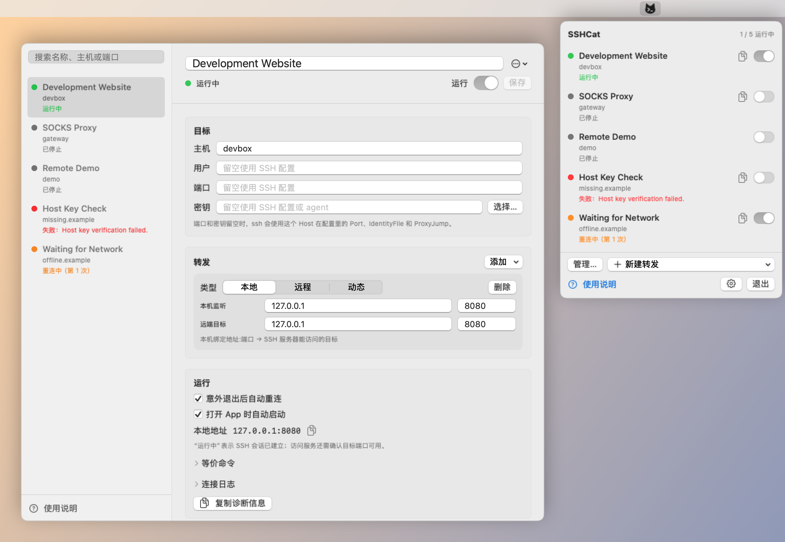

# SSHCat

[English](README.md) · **简体中文**

macOS 菜单栏工具：管理长期运行的 SSH 端口转发。App 不实现 SSH 协议，只以子进程方式执行 `ssh -N`，并在进程退出、系统唤醒或网络变化后按退避重连。

一条规则对应一次 `ssh`：同一个目标上可以混用本地转发（`-L`）、远程转发（`-R`）和动态转发（`-D`）。



截图由临时示例数据和假 ssh 渲染，不包含真实配置或连接。

## 要求

- macOS 13+（Apple 芯片或 Intel）
- 系统自带的 `/usr/bin/ssh`（设置里可以改成别的路径）
- 目标主机已经能用密钥或 ssh-agent 登录。App 使用 `BatchMode=yes`，不会弹出密码框
- 第一次连接某台新主机前，先在终端里 `ssh` 一次并接受主机密钥（写入 `~/.ssh/known_hosts`）。`BatchMode=yes` 下 ssh 不会询问，未知主机会直接连接失败

## 安装

1. 从 [Releases](https://github.com/zhdsmy/SSHCat/releases) 下载 `SSHCat-<版本>.dmg`，打开后把 SSHCat 拖进“应用程序”。
2. App 只做了 ad-hoc 签名、没有经过 Apple 公证，首次打开会被拦下：到“系统设置 › 隐私与安全性”点“仍要打开”，或执行 `xattr -dr com.apple.quarantine /Applications/SSHCat.app`。
3. 可选：用同目录的 `.sha256` 校验下载，`shasum -a 256 -c SSHCat-<版本>.dmg.sha256`。

设置中的“检查更新”仅在点击时访问 GitHub；发现新版本后，从下载页获取 DMG 替换 App，不会自动安装。

## 语言

支持 English、简体中文和繁體中文。默认跟随系统语言；系统语言不受支持时回退到英语。可在“设置 › 通用 › 语言”选择覆盖语言，下次启动生效，切换设置不会重启或中断正在运行的转发。

菜单、管理窗口、使用说明、校验错误、通知与诊断共用语言资源。规则名称等用户数据、SSH 命令及 SSH 原始日志保持原样，不会因为切换语言改写已保存的规则。

## 构建

```bash
./scripts/bundle.sh                  # build/SSHCat.app
open build/SSHCat.app
UNIVERSAL=1 ./scripts/make-dmg.sh    # build/SSHCat-<版本>.dmg（arm64 + x86_64）与 .sha256
```

`bundle.sh` 默认只构建本机架构；`UNIVERSAL=1` 同时构建 arm64 与 x86_64，并用 `lipo` 检查两者都在（发布用）。`make-dmg.sh` 会先调用 `bundle.sh`，版本号取自 `Resources/Info.plist`。

测试与图标：

```bash
swift build
swift build --product SSHCatPackageTests && swift test --skip-build
swift scripts/make-icon.swift   # Resources/AppIcon.icns（菜单栏图标在 Sources/SSHCat/MenuBarIcon.swift 里用代码绘制）
```

只装了 Command Line Tools 时，`swift test` 需要先单独构建测试产物（上面第二行）；装了 Xcode 可直接 `swift test`。

安全检查界面：

```bash
./scripts/snapshot.sh --language=en          # build/snapshots-en/
./scripts/snapshot.sh --language=zh-Hans     # build/snapshots-zh-Hans/
./scripts/snapshot.sh --language=zh-Hant --dark # build/snapshots-zh-Hant-dark/
```

快照入口仅在 debug 构建中可用，使用临时数据、隔离偏好和 `/bin/sh` 假 ssh；不读取真实规则或 `~/.ssh/config`，不触碰登录项，也不建立真实 SSH 连接。覆盖正常、空白、失败、重连、未保存草稿、搜索、长名称、多规则、更新提示与不支持的数据版本；滚动页面会追加 `-scroll-N` 图片。图片不含标题栏和工具栏，未聚焦窗口的开关可能显示灰色；快照不代替点击、键盘与系统窗口交互测试。

`swift build` 出来的二进制没有打成 App，会带 Dock 图标。菜单栏形态以 `build/SSHCat.app` 为准。App 只做了 ad-hoc 签名。

开发模式：

```bash
swift run SSHCat
```

## 新建一条转发

1. 点菜单栏“新建转发”，选择本地、远程转发或 SOCKS 代理；也可在管理窗口的新增菜单或“使用说明”中创建。
2. 主机填 `~/.ssh/config` 里的 Host 名，或直接填主机名。用户、端口、密钥留空时沿用该 Host 的配置。
3. 需要覆盖时再填端口（传给 `-p`）或密钥路径（传给 `-i`，并加上 `IdentitiesOnly=yes`）。
4. 添加转发：
   - 本地：本机 `绑定地址:端口` 转到 SSH 服务器能访问的 `目标主机:端口`
   - 远程：SSH 服务器上的 `绑定地址:端口` 转到本机的 `目标主机:端口`。绑定地址不是回环时，服务器要开 `GatewayPorts`
   - 动态：本机 SOCKS 代理
5. 打开规则。状态为“运行中”后，本机对应端口即被占用；关掉规则后端口释放。

管理窗口支持按名称、主机或端口搜索。“…”中的“创建副本”保留已保存配置并关闭副本的自动启动；修改监听端口可避免与原规则冲突。未保存的修改会在切换规则或关闭管理窗口后保留，菜单和详情都不会启动带有待保存修改的已停止规则；保存成功后才应用到运行中的连接。草稿仅保留到退出 App 为止。

菜单显示各规则的连接状态，规则较多时可以滚动。详情中的本地地址可快捷复制，等价命令和连接日志可展开查看；复制按钮短暂显示“已复制”。“运行中”表示 SSH 会话已建立，目标服务是否可访问仍取决于目标端口和服务本身。

例如把远端回环的 8080 转到本机 8080，用户 `app`、主机 `devbox`、一条本地转发，两端都是 `127.0.0.1:8080`。生成的命令形如：

```text
ssh -N -o ExitOnForwardFailure=yes -o BatchMode=yes \
  -o ControlMaster=no -o ControlPath=none \
  -o ServerAliveInterval=15 -o ServerAliveCountMax=3 \
  -o ConnectTimeout=10 -o LogLevel=VERBOSE \
  -L 127.0.0.1:8080:127.0.0.1:8080 app@devbox
```

`ControlMaster=no` 让这条连接的生命周期归 App：关掉规则就会停掉转发，而不会挂在用户自己的 ControlMaster 上。`ServerAlive*` 让断掉的会话自己退出，再按指数退避重连。`ExitOnForwardFailure=yes` 让监听端口失败时 ssh 立刻退出，而不是假装还在转发。`ConnectTimeout=10` 让连不上的主机 10 秒内失败。`LogLevel=VERBOSE` 让 ssh 在认证成功后打印 `Authenticated to …`，App 以此判定“运行中”，而不是进程一启动就算成功。

界面可以复制这条等价命令。实际启动一律以 argv 执行，不经 shell。

## 数据位置

`~/Library/Application Support/SSHCat/`（目录 0700；文件 0600，原子写入）

| 文件 | 说明 |
| --- | --- |
| `forwards.json` | 转发规则 |
| `pids.json` | 子进程 pid，崩溃后用于清理孤儿 `ssh` |

偏好设置在 UserDefaults（suite `io.github.zhdsmy.SSHCat`）：`customBinaryPath`、`notificationsEnabled`、`language`。旧版本没有语言设置时自动跟随系统。登录项由系统的 `SMAppService` 记录。App 不保存密码或私钥内容。

规则新增、修改和删除均先保存成功再更新界面与进程；保存失败时保留原规则、运行中的连接和编辑草稿，并显示可重试的错误。读取失败或数据版本不受支持时保留原文件并禁止覆盖，修复后可“重新加载配置”。损坏的 JSON 仅在成功备份后才允许从空列表继续；备份失败会阻止保存。数据格式仍为 v1，旧规则继续兼容。

## 实现要点

- `SSHCatCore` 不依赖 SwiftUI，包含模型、参数构造、进程监管；单元测试用 `/bin/sh` 冒充 ssh。
- 子进程输出由专用线程阻塞读取，避免长期运行的 ssh 占住 GCD 线程。
- 界面不用 SwiftUI 宏（`@State`、`@Observable`、`#Preview`），以便只装 Command Line Tools 时也能编译。

## 参与开发

本地化采用 SwiftPM 的原生 `.lproj/*.strings` 资源，位于 `Sources/SSHCatCore/Resources/`。`Localizable.strings` 保存界面文案，`Core.strings` 保存模型、错误、通知和诊断文案，均通过 Foundation 层的 `L10n` 读取；新增文案使用稳定的英文语义键，并同时更新 `en`、`zh-Hans`、`zh-Hant`。参数使用 `%@`、`%ld`，需要调整语序时使用位置参数，不拼接翻译后的句子。

测试检查语言匹配、三种语言键的完整性、格式参数一致性与源码引用；打包脚本把 SwiftPM 资源 bundle 一起放入 App。修改文案后运行相关语言的深浅色快照，避免英文长文本被截断。快照默认英语，可用 `--language` 指定，示例规则名称保持固定以便跨语言对比。

开发规范、安全约束、提交格式、版本号规则与发布流程见 [AGENTS.md](AGENTS.md)，变更记录见 [CHANGELOG.md](CHANGELOG.md)。推送 `vX.Y.Z` tag 后，GitHub Actions 会构建 universal DMG 并发布到 Releases。

## 许可证

[MIT](LICENSE)
